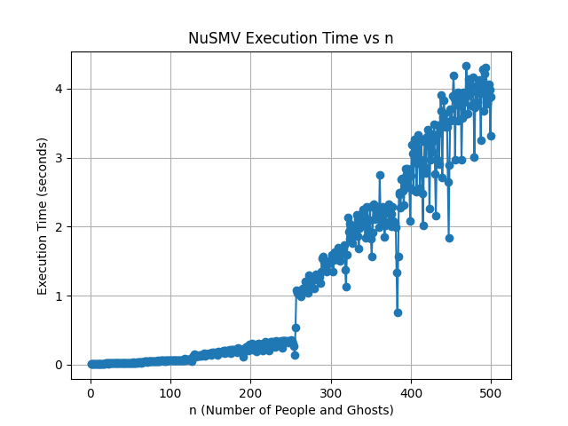

# 软件形式化验证期中作业

# 人鬼过河问题

## 第 1 问
3 个人, 3 只鬼时的构造:
```
  -> State: 1.1 <-
    x = 0
    y = 0
    boat = left
    delta = 2
  -> State: 1.2 <-
    x = 1
    y = 1
    boat = right
    delta = -1
  -> State: 1.3 <-
    x = 0
    boat = left
    delta = 2
  -> State: 1.4 <-
    y = 3
    boat = right
    delta = -1
  -> State: 1.5 <-
    y = 2
    boat = left
    delta = 2
  -> State: 1.6 <-
    x = 2
    boat = right
    delta = -2
  -> State: 1.7 <-
    x = 1
    y = 1
    boat = left
    delta = 2
  -> State: 1.8 <-
    x = 3
    boat = right
    delta = -1
  -> State: 1.9 <-
    y = 0
    boat = left
    delta = 2
  -> State: 1.10 <-
    y = 2
    boat = right
    delta = -1
  -> State: 1.11 <-
    y = 1
    boat = left
    delta = 2
  -> State: 1.12 <-
    y = 3
    boat = right
```

## 第 2 问

设 $m$ 为人数，$n$ 为鬼数

当 $m>n$ 时有解.

当 $m=n$ 时, 仅 $m = n \leq 3$ 时有解.

执行时间:



当 $n$ 趋于 256 附近时, NuSMV 运行时长发生了较为明显的跳变. 而 256 恰为 2 的幂次, 推测这并非巧合.

